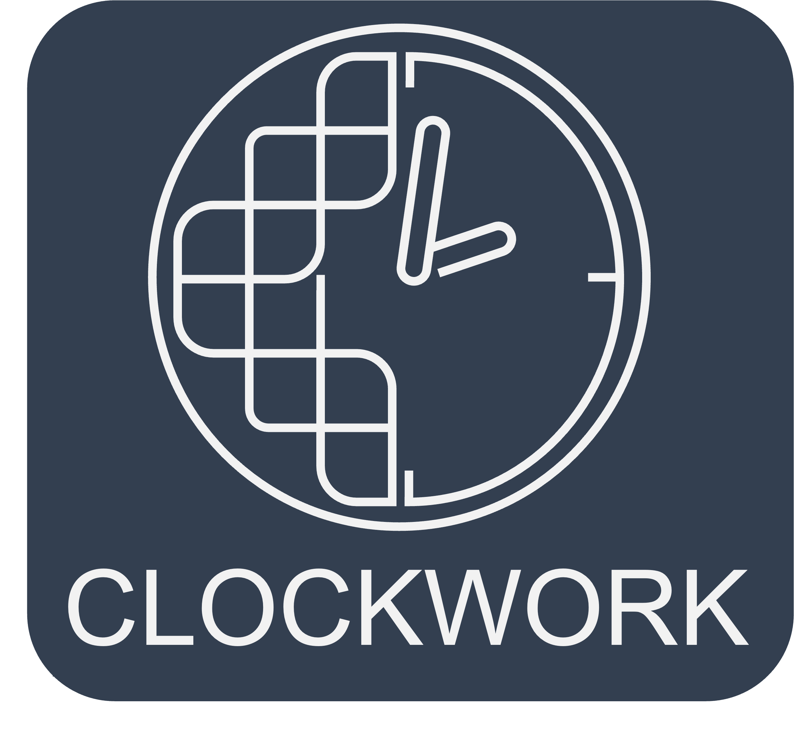

# Clockwork Chess Engine

<p align="center">
  
</p>

<div align="center">
  A chess engine written in Rust, designed for performance and modularity.
  <br>

  <a href="https://github.com/dominjack/clockwork/issues">Report Bug</a>
  ·
  <a href="https://github.com/dominjack/clockwork/issues">Request Feature</a>

  [](/LICENSE)
  
</div>


## About The Project

Clockwork is a project born from a fascination with the intricate logic of chess. It's a journey to build a chess engine from the ground up, exploring the world of move generation, board evaluation, search algorithms and learning Rust. The goal is to create a strong and efficient engine while maintaining a clean and modular codebase.

This project is a continuous work in progress, and I welcome any feedback or contributions from the community.

## Workspace Structure

The project is organized as a Cargo workspace with the following crates:

-   `chess_core`: This crate contains the core data structures and logic for the chess engine. It includes modules for board representation, move generation, FEN parsing, and other fundamental chess concepts.
-   `clockwork`: This crate contains the main application logic, including the UCI (Universal Chess Interface) implementation, which allows the engine to communicate with graphical user interfaces (GUIs).
-   `tests`: For integration tests.

## Getting Started

To get a local copy up and running, follow these simple steps.

### Prerequisites

-   [Rust toolchain](https://www.rust-lang.org/tools/install)

### Installation & Building

1.  **Clone the repository:**
    ```sh
    git clone https://github.com/dominjack/clockwork.git
    ```
2.  **Build the project in release mode:**
    ```sh
    cargo build --release
    ```

## Usage

### Running the Engine

To run the UCI engine, use the following command:

```sh
cargo run --release --bin clockwork
```

You can then connect the engine to any UCI-compatible GUI, such as:
- [Arena](http://www.playwitharena.de/)
- [Cute Chess](https://cutechess.com/)
- [Lichess](https://lichess.org/developers) (via the external engine feature)


### Running Tests

To run the test suite, which includes perft tests and comparisons with Stockfish, use the following command:
```sh
cargo test --release
```

### Generating Magics

To generate magics, use the following command:
```sh
cargo run --release --bin magicgen
```

## Playing strength
The engine is not rated by [CCRL](https://www.computerchess.org.uk/ccrl/). The best estimation from playing against [Stockfish](https://github.com/official-stockfish/Stockfish) with different elo settings is around **2500** elo against humans. 

From testing against [Rustic](https://rustic-chess.org/front_matter/about_rustic.html) and [Lux](https://github.com/Sidhant-Roymoulik/Lux), the CCRL elo can be estimated between **2050** and **2150**.


## Features

- **Architecture and move generation**:
  -   **Bitboard Representation:** A fast and efficient board representation.
  -   **Magic Bitboards:** For fast generation of sliding piece moves.
  -   **Zobrist Hashing:** For efficient transposition table lookups.
- **Search**:
  -   **Alpha-Beta Search:** With quiescence search to avoid the horizon effect.
  -   **Transposition Tables:** To cache previously searched positions.
  -   **Iterative Deepening:** To provide early results and improve search efficiency.
  -   **Move Ordering:** Including MVV-LVA and other heuristics to improve search performance.
  -   **Late Move Reductions:** Save time on bad moves.
  -   **Check Extensions:** Make sure to not end search in check.
  -   **Killer Moves:** Prefer searching nodes that beta cuts.
  -   **History Heuristics:** Prefer searching nodes that raise alpha.
  -   **PeSTO Tables:** Use optimized Piece Square Tables.
  -   **Null Move Pruning:** Limiting search space by shallow search after passing move.
-   **UCI Protocol:** For communication with GUIs.

## Roadmap

- [ ] Improve evaluation function with more advanced concepts.
- [ ] Tune evaluation parameters.
- [ ] Implement more advanced search techniques.
- [ ] Add support for multi-threading.

## Contributing

If you have a suggestion that would make this better, please fork the repo and create a pull request. You can also simply open an issue with the tag "enhancement".
Don't forget to give the project a star! Thanks!

1.  Fork the Project
2.  Create your Feature Branch (`git checkout -b feature/AmazingFeature`)
3.  Commit your Changes (`git commit -m 'Add some AmazingFeature'`)
4.  Push to the Branch (`git push origin feature/AmazingFeature`)
5.  Open a Pull Request

## Acknowledgements
- [Cutechess](https://github.com/cutechess/cutechess) and [Fastchess](https://github.com/Disservin/fastchess.git) for engine testing 
- [Stockfish](https://github.com/official-stockfish/Stockfish), [Reckless](https://github.com/codedeliveryservice/Reckless/tree/main), [Rustic](https://rustic-chess.org/front_matter/about_rustic.html) and many other engines
- [Chess Programming Wiki](https://www.chessprogramming.org/Main_Page)

## License

Distributed under the MIT License. See `LICENSE` for more information.
